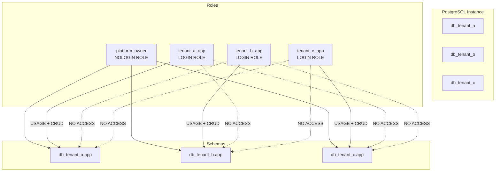

# Multi-Tenant PostgreSQL Architecture

## Overview

This document describes a multi-tenant PostgreSQL architecture designed to support multiple tenants on a single database server (for example, a single AWS RDS PostgreSQL instance) while preserving strong isolation between tenants.

The primary goal is to reduce infrastructure cost (fewer RDS instances) without compromising tenant data isolation or complicating accreditation in sensitive environments (e.g., DoD AWS).

## High-Level Design

Key design points:

- One PostgreSQL **server (cluster)** per environment (e.g., per IL2/IL4 environment).
- One **database per tenant**:
  - `db_tenant_a`
  - `db_tenant_b`
  - `db_tenant_c`
- One **login role per tenant application**:
  - `tenant_a_app`
  - `tenant_b_app`
  - `tenant_c_app`
- One **dedicated schema per tenant database**:
  - `db_tenant_a.app`
  - `db_tenant_b.app`
  - `db_tenant_c.app`
- The default `public` schema is **not used** for tenant data and is locked down.
- Tenants have:
  - `CONNECT` only to their own database.
  - `USAGE` and `CREATE` only in their own schema.
- No cross-database extensions (e.g., `dblink`, `postgres_fdw`) are enabled for tenant roles.

## Logical Model

Per tenant:

- **Database**: logical boundary for data and privileges (`db_tenant_a`)
- **Schema**: namespace for tenant objects (`app`)
- **Role**: used by the tenant’s application (`tenant_a_app`)

Relationships:

- One application role per tenant database.
- The role owns or is granted access to the tenant’s `app` schema.
- No tenant role has permissions on another tenant’s database or schema.

### Architecture Diagram

## Example Mapping: Local Docker to AWS RDS

Local development:

- `docker-compose.yml` starts a single PostgreSQL container.
- `init/01_init_tenants.sql`:
  - creates tenant databases and roles,
  - configures basic privileges,
  - creates sample tables for testing.
- `scripts/test_isolation.sh`:
  - verifies databases, schemas, and row-level access.

AWS deployment (future, via Terraform):

- An AWS RDS PostgreSQL instance replaces the local container.
- A Terraform `postgresql` provider manages:
  - databases (`postgresql_database`)
  - roles (`postgresql_role`)
  - schemas (`postgresql_schema`)
  - grants (`postgresql_grant`)
- The same logical design is applied to RDS using infrastructure-as-code rather than init scripts.

## Data Isolation Summary

Data isolation is achieved through:

- **Database-level isolation**:
  - `REVOKE CONNECT` on tenant databases from `PUBLIC`.
  - `GRANT CONNECT` only to the tenant’s application role.
- **Schema-level isolation**:
  - Only the tenant’s role has `USAGE` and `CREATE` in its `app` schema.
  - `public` is not used for tenant tables and can be fully locked down.
- **No cross-DB bridges**:
  - Cross-database extensions are not created for tenant roles.
  - Only admin roles can create extensions, and those are tightly controlled.

This allows many tenants to share a single PostgreSQL server while maintaining strong boundaries and reducing the number of RDS instances required.
